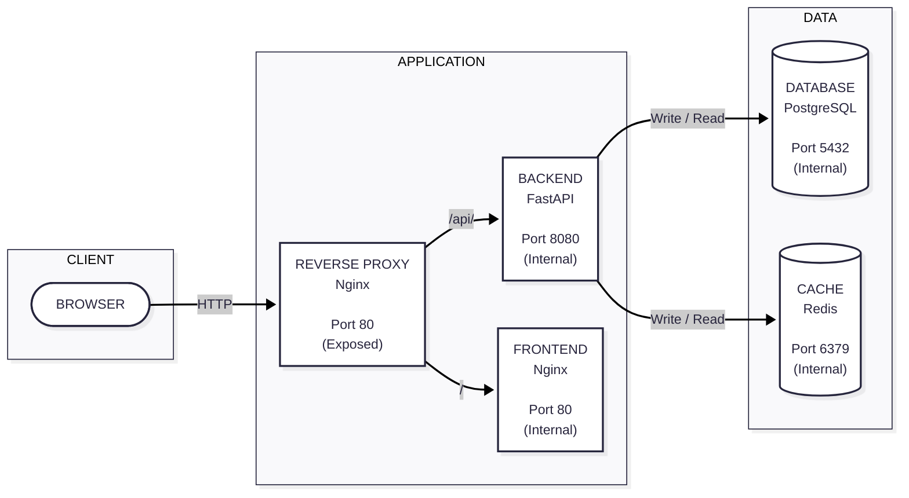

# Architecture

...

## Stack

The stack is orchestrated over a network of containers (*holberton_net*), and is made of:

- A `PostgreSQL` **Database** on port **5432** internally (*holberton_db*), using the official `postgres:16` image
- A `Redis` **Cache** on port **6379** internally (*holberton_cache*), using the official `redis:7` image
- A minimal `FastAPI` **Backend Application** on port **8080** internally (*holberton_backend*), built from `backend/Dockerfile`
- A simple **Frontend Webpage** served through `Nginx` on port **80** internally (*holberton_frontend*), built from `frontend/Dockerfile`
- A basic `Nginx` **Reverse Proxy** exposed on port **80** (*holberton_reverse_proxy*), using the official `nginx:latest` image

## Diagram

The following diagram illustrates the stack orchestration:

